# Azure Cognitive services with NodeRED

now that you have the IBM Watson Cogntive services working in NodeRED,
let's see what would be needed to do the same/similar with Microsot Azure Cognitive Services.

You will need to add a [Computer Vision](https://azure.microsoft.com/en-us/services/cognitive-services/directory/vision/) service subscription
to your Azure account. We will use a limited free service subscription for this.

## Azure Computer Vision subscription
Let's start with create the computer vision resource in the Azure portal

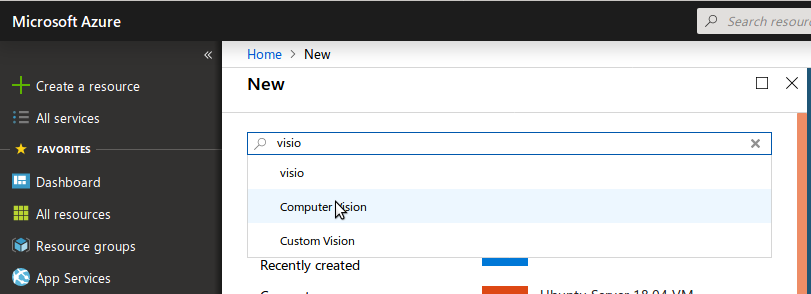

Select "Computer Vision"

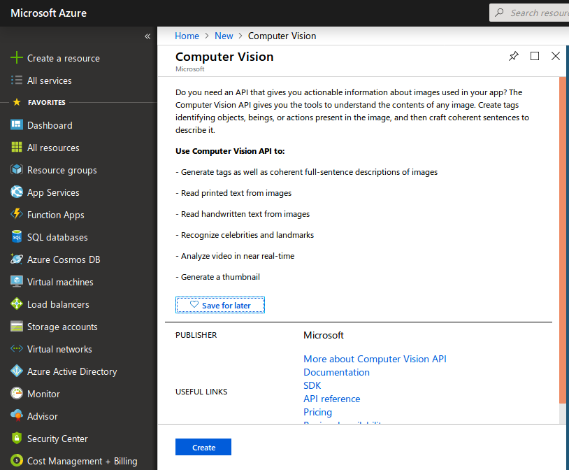

Click `Create`

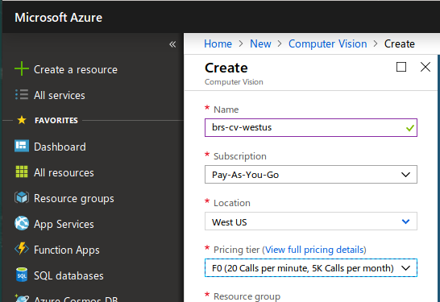

**Note** that the Location property has been overidden to **"West US"** -
this is necessary for the current version of the Azure NodeRED nodes,
which do not yet provide a means of selecting different regional endpoints.

**Note** the Pricing tier has been set to F0 - a free, but restricted plan.

Again, click `Create`

Once the subscription is active, you will be able to see it in the "All resources" view:

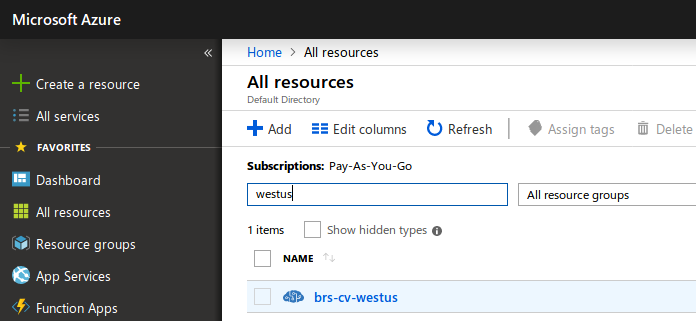

Click on the subscription name (in this case, "brs-cv-westus") to view its details:

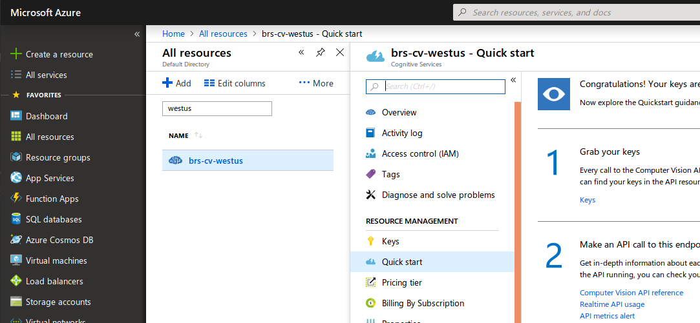

At this point, we are particularly interested in the  `Grab your keys` section -
the API will be added into the configuration of the NodeRED Azure node.
Click on`Keys`

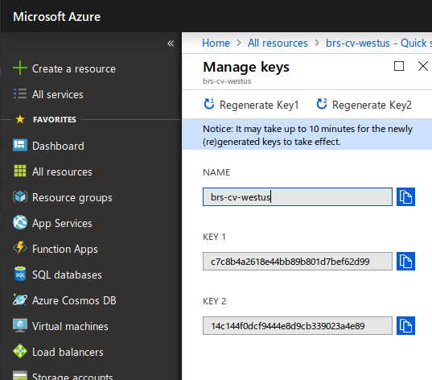

Here, you wil see 2 keys - either one can be used -- copy one to your favourite scratchpad for later use.

Use a similar process to set up subscriptions for other Cognitive Services.

## NodeRED setup for Azure Cognitive Services

With a minor modification to the existing image classification flow,
you can enhance the image interpretation -
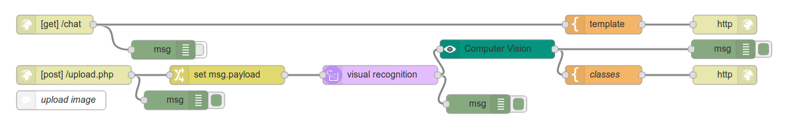

For this to work, you will need to install the `node-red-contrib-cognitive-services` package.
Use the "Manage Palette" method to does this.
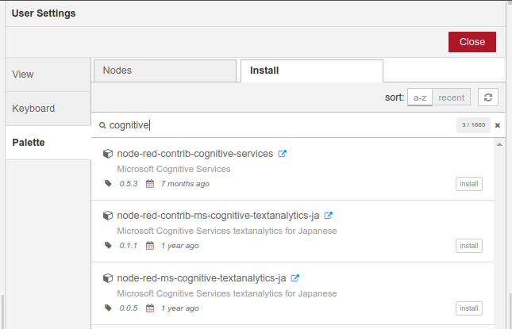

You should now have, in the left-hand palette, a new set of nodes

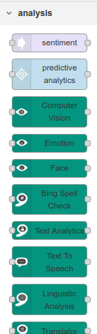

Pull the `Computer Vision` node onto the canvas and link it into the existing flow, between the Watson Visual Recognition node, and the output template node.

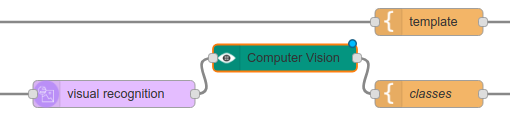

and configure with the subscription API key

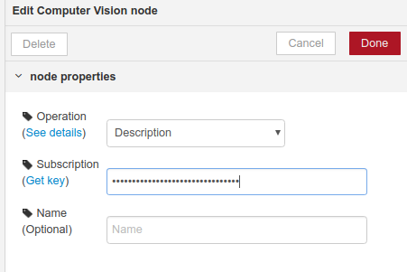.

Almost ready to update the runtime, but the content/format of the output from the Azure service is not known; add a `debug` node after the `computer vison` node,
to allow inspection of the data returned from the API call.

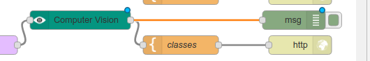

Click the `Deploy` button

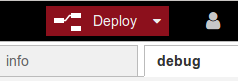

Now, redo the image classification, and observe the output in the NodeRED debug window.
The key piece of content that Azure provides is a descriptionn of the image, which you can find in the `msg.detail.description.captions` array

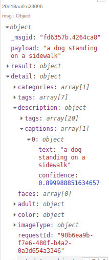

All that is needed now is to incorporate that information into the response template

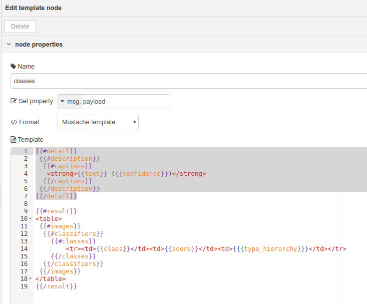

The new template will be
```
{#detail}}
 {{#description}}
  {{#captions}}
   <strong>{{text}} ({{confidence}})</strong>
  {{/captions}}
 {{/description}}
{{/detail}}

{{#result}}
<table>
 {{#images}}
  {{#classifiers}}
    {{#classes}}
        <tr><td>{{class}}</td><td>{{score}}</td><td>{{{type_hierarchy}}}</td></tr>
    {{/classes}}
  {{/classifiers}}
 {{/images}}
</table>
{{/result}}
```
You can copy/paste this into the template node, if you like.

After deploying again, the user will see extra information on the classification page:

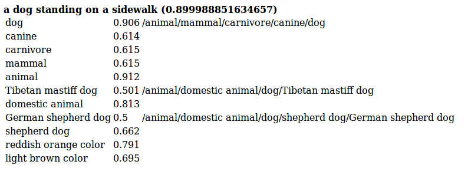
