# Watson Cognitive Services from NodeRED
## A Simple Image Classifier

When NodeRED is deployed into the IBM Cloud runtime [CloudFoundry](https://www.cloudfoundry.org),
it is preconfigured with the `node-red-node-watson` package - which makes creating flows to exploit Watson Cognitive services like:
  - Visual Recognition - image classification
  - Speech to Text - transcription of audio
  - Text to Speech - synthesis of speech with a varity of voice options
  - Tone Analyzer - identify emotional content of Text
  - Translation - translate between languages
  - Discovery - extract content and metadata from documents
  - Assistant - natural language processing for chatbot operations

  The associated nodes appear in the selection palette in the IBM Watson section 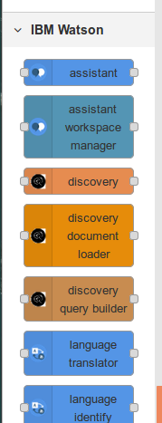

  To give you experience with the Watson services, let's get you set up with a app to load and preview an image, before submitting the image to Watson Visual Recognition to general classification.

The NodeRED flow uses a sample upload form process from [Web Code Geeks](https://www.webcodegeeks.com/html5/html5-file-upload-example/) imbeded in this flow:
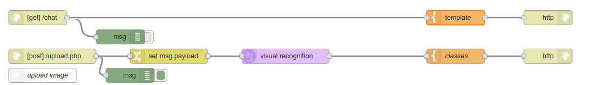

The interface for the app is deliberately simplistic:

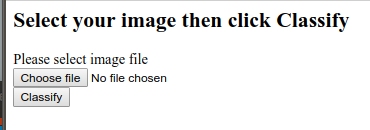

Click `Choose file`
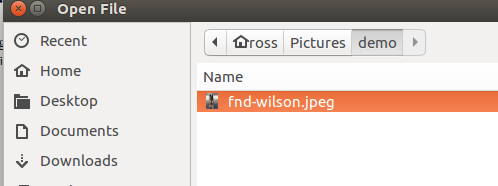

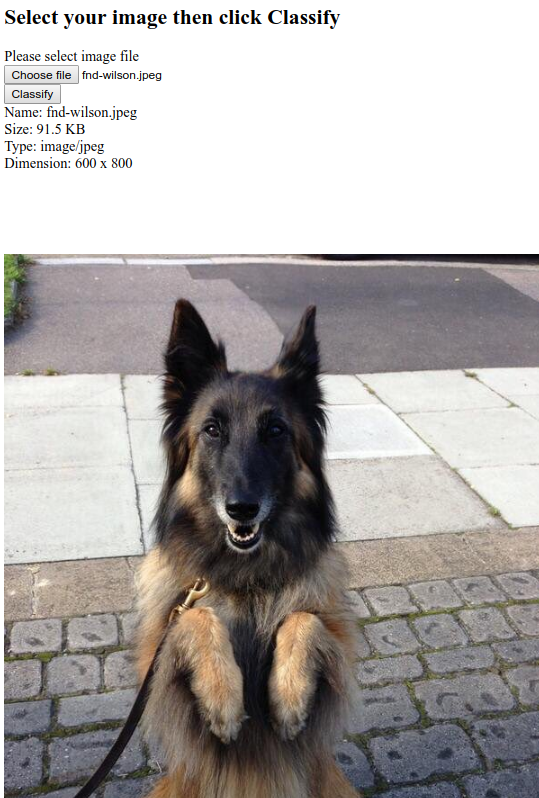

Click `Classify` to invoke Watson Visual Recognition.
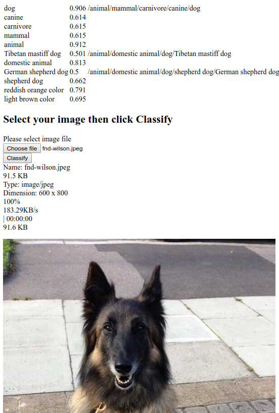

## Import the flow
You will find the flow discussed here can be imported into your NodeRED environment from [nodered-visrec-flow.json](nodered-visrec-flow.json).

Simply open the above link, and copy the content of the file to the clipboard.

Then, from the NodeRED menu , open the `Import` --> `Clipboard` option 

Paste the flow from the clipboard into the `Import nodes` window 
and click `Import`

This will let you drop the flow onto the NodeRED editing canvas.

## Prepare the Watson Recognition Service
As with the Machine Learning example, you will need to create a Watson Visual Recognition service instance in your IBM Cloud account

1. From the IBM Cloud console, select the `Catalog` option from the top menu bar 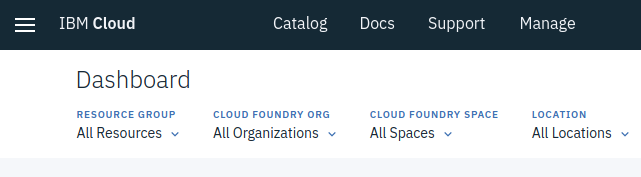.

1. Type "visual" in the search/filter area 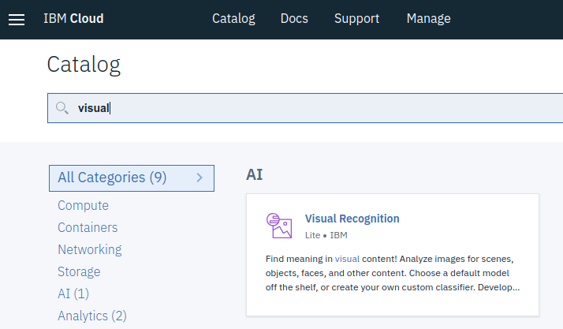.
Click on the `Visual Recognition` link.

1. Wait for the `Create` button to activate 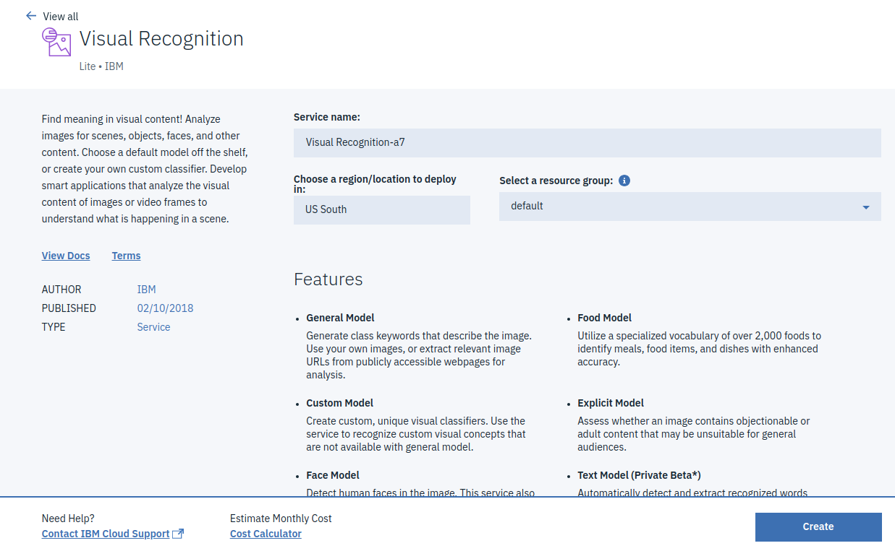 **Note** you may need to select `US South` or `United Kingdom` for the region/location as this may default to `Sydney`.
Click `Create` and you should see the service overview 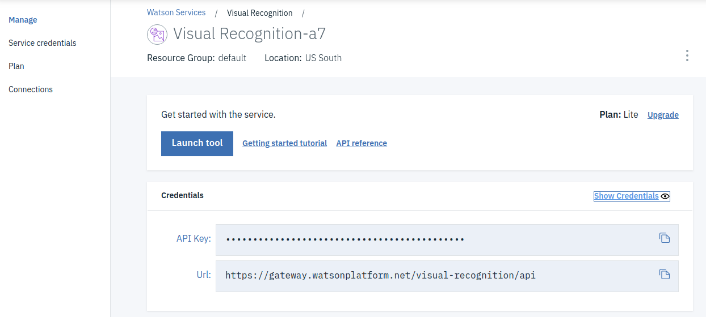

1. Copy the `API key` value to the clipboard, or your favourite scratchpad; this will be needed to configure the NodeRED Visual Recognition node to authorize use of the underlying API.

## Breaking it down into stages

1. The starting `/chat` node is again an endpoint, which can be invoked from a browser

1. The template node packages the javascript, and the form needed to perform the preview and upload preparation.
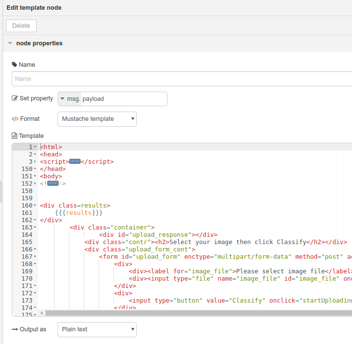 **Note** the mustache replacement parameter `{{{results}}}` -- this allows other flows to inject results into the main page. The second flow uses this to return the classification values from Watson Visual recognition

1. the second flow starts with the `upload.php` input node - this is where the form in the first flow posts the image to get it classified.
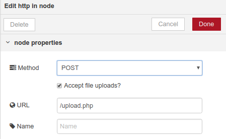 **Note** the option for accepting file uploads has been checked.

1. The Switch node `set msg.payload` is used to load the input buffer to the Watson Visual Recognition node with the first/only image uploaded.
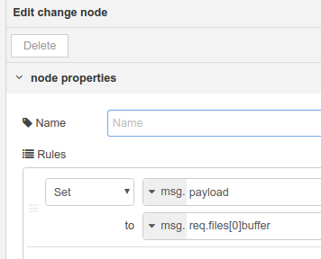

1. The Visual Recognition node will pass the image to the Watson service, and forward the results to the rest of the flow.
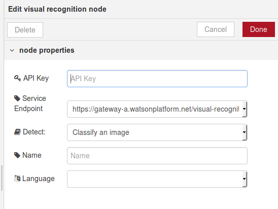 **Note** this is where you need to paste the Watson service API key you copied earlier.

1. the output from Watson Visual Recognition is a JSON object - it can be formatted using the Mustache template node for display on the main page:
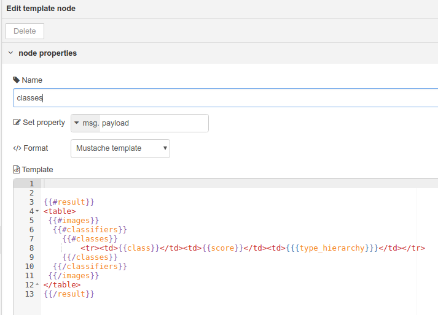 (I know, HTML tables are not cool, but they are easy!)
